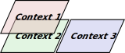

[← back to README/table of contents](README.md)

# Definition, requirements and challenges

Before learning about myappmaker's design we must know what it is supposed to be, as well as its requirements and design challenges.

## myappmaker's definition

myappmaker is an app maker tool consisting of a graphical application that relies on low-code/no-code interfaces to allow users to create their own desktop applications, including a drag-and-drop interface and a block coding interface. It is a Python desktop application built on top of the PySide6 GUI framework, meant to run on any platform that supports the reference implementation of the Python programming language ([GitHub repo](https://github.com/python/cpython) | [website](https://python.org)).

In addition to that, its block coding interface should be able to take advantage of Python and its many libraries.

Why another app builder? Because even though many other app builder software exist today, regardless of their ease-of-use and how intuitive they are for users, they present many crucial limitations. First of all, many of them are commercial/paid software, which, despite not being a problem per se, prevents access to the tool by many people who can't afford the prices. They also are often made available only as web/cloud or mobile apps. On top of leaving users overly dependent on such platforms, this also prevents people from taking advantage of their plenty capable, often faster, computers. A standalone desktop app would give users much more freedom and performance.

Just like any software under the Indie Python project, myappmaker would also be 100% free, open-source and not in control of any organization that could pull it away from users.

## Requirements (and a few nice-to-haves)

These requirements/nice-to-haves are listed here with no particular structure. Sometimes we present them in lists, sometimes in regular text so they can be further expanded upon. Sometimes the text also clarifies that some requirement should be treated as a nice-to-have instead, as adopting it from the beginning would require too much time/effort or would be too difficult considering the tech stack at hand.

All of these requirements and discussions on them are gathered here as a means to keep track of them as we analyse, integrate and refine them into an unified cohesive design.

The original idea and requirements for myappmaker were gathered from posts on Hacker News and sometimes in discussions on channels of the Indie Python project, such as its Discord server.

Initial list of requirements:

- drawing a user interface as naturally as in a specialized drawing program (examples include Inkscape, Adobe Illustrator, Macromedia Freehand)
- programming the UI as naturally as-is possible (examples include the HyperTalk language in HyperCard, or AppleScript (and to a lesser extent Lisp) with some aspects being presented visually as in Scratch or Google's Blockly)
- have a pane or other area for variables since the act of drawing does not instantiate variables (an example of this would be OpenSCAD's Customizer)
- a standalone app
- could create standard GUI elements (buttons, text editing fields, drop-down menus, &c.)
- a decent library of packages which could be imported at need
- SVG output --- being able to save a program as an SVG visual representation would be _huge_ for documentation
  - METAPOST (consider as a possible model or reference) --- there isn't a graphical tool for this, and it is incredibly powerful, and if there was a graphical editor which used .mp as its/a source format that would be incredibly powerful (it is possible, or even likely that METAPOST support would be something done in a reference implementation/example program/standard library)
  - Bézier curve support (pretty much a requirement for SVG) --- these allow drawing essentially anything, and including them as an object/element type would ensure pretty much anything anyone could envision could be drawn
  - simple drawing/editing of vectors --- one example of an elegant and user-friendly user interfrace for this is Futurewave Smartsketch/Flash. Interestingly, this drawing tool became an animation/scripting solution, so arguably one description of this project might be "Flash successor" --- note that there is an opensource tool which is implementing this drawing model: https://www.wickeditor.com/#/
- accessibility --- the ideal, would be something like to https://beeware.org/project/projects/libraries/toga/ since it uses native objects on each platform, but this tool should be important enough to folks who want something like it that giving up accessibility would be an acceptable trade-off, (naturally, if this is the case it will be made clear as a limitation up-front
- possibility of running on either Chrome OS or Android (or even iPad?) --- there are a lot of school systems which provide such to students and being able to offer an option for education, esp. if it would be possible to set up a support system for schools could be _huge_
- Raspberry Pi --- the new 5 seems an incredible value, and there is a nifty new tablet version of it which raises one kind of wild possibility:
  - LCARS --- "Library Computer Access and Retrieval System", this is the computer "interface" shown on _Star Trek: The Next Generation_ and later shows --- having this GUI toolkit as a potential development platform would be a great way to differentiate this project, and possibly generate a lot of interest, and harvest a lot of potential energy and development fervor (the Raspberry Pi 5 tablet in question is the Pilet: https://soulscircuit.com/pilet )
- Themes --- note that the LCARS interface as a development target would beone of multiple (if possible) GUI toolkits which are supported

Additional thoughts and considerations (originally from a private e-mail):

One early decision will need to be what drawing features are initially available. It seems uncertain that complicated drawing facilities will be needed/required --- certainly HyperCard/LiveCode did not have overly complex drawing capabilities, but one possible avenue of research, just to be aware of it as a metric to measure against and to contrast against would be SVG with embedded JavaScript as an interactive format --- consider these drawings:
 
https://raw.githubusercontent.com/shapeoko/Docs/1c2ceb2f7fca11a4895ef3aeddd9d03976b21139/content/tPictures/PS20029-100.svg
https://raw.githubusercontent.com/shapeoko/Docs/1c2ceb2f7fca11a4895ef3aeddd9d03976b21139/content/tPictures/PS20022-100.svg

(from the instructions for the Shapeoko 2 CNC machine)

At the time of their creation  allowed clicking on the parts list which would then highlight the matching parts in the diagram --- presumably if javascript interactivity were enabled in a modern browser they would still work.

Possible output formats are pretty obvious --- compiling to HTML or SVG with Javascript would be the easiest deployment, but technically complex, writing out a stand-alone .py file would be a welcome option but may only work for a simplistic subset of the application's capabilities, and as noted elsewhere the native fileformat will be a .zip archive with identifying file extension which the development environment would be able to "play".

A basic workflow/set of functions:
 
- visually layout the window of a program
- interactively select elements of the program and code up behaviours and functionality
- compile/export the program into some sort of file which could then be uploaded to GitHub (along with the source) and from there either run (say HTML web page w/ Javascript on a Github.io linked page) or to a .py file (with additional resources), or some sort of compiled file w/ runtime if need be

The requirements related to mobile/browser support were later deemed as nice-to-haves and postponed to a distant future, though, as made evident by this email exchange:

> (from Kennedy) About running on Chrome OS/Android/iOS, these would be huge additions of time and effort to our project, so I can't promise anything. The language used (Python) is also a barrier, cause Android ad iOS don't offer native support to these systems (at least that I know of). I too would be glad if I could provide such options as well, though, so I'll take a look into the possibilities in my research for the action plan.  To be completely honest with you, the incompatibility with mobile OSes is something that's been making me consider becoming proficient at another language in order to complement my development skills and the reach of my tools. If any of my projects reaches a large userbase, I wouldn't mind porting it to another language and system. But this is something for the distant future. Let me just add that I don't blame the Python ecosystem for the limitation I just mentioned. I think the organizations behind the mobile systems could have designed their systems to be compatible with other widely used existing technology/langs.
> 
> (from Adams) Interesting, I hadn't considered that, but thinking on it it makes sense.  Any sort of mobile support would be welcome, but it certainly isn't something I would want to put in place as a requirement --- this is entirely up to your decisions and determinations.  If changing the language back end would allow supporting this, I would see that as a worthy reason to make such a choice.

Of course there are ways to integrate Python into these environments. However, what we worry about is whether the current capabilities of those mobile solutions meet the needs of this project, which is already complex enough even for desktop.

In our conversations, Mr. Adams also mentioned Godot and gdscript as technologies he's been keeping an eye out for, given its wide range of applications, like its usage for UI programming in screens from Tesla vehicles. Despite being a game engine and not an app builder, Godot's versatility sets it as a great inspiration for app builder projects. As a matter of fact, not being in the category of app builder software doesn't make Godot any less suitable for app making. In fact, many business and developers use it to develop all kinds of applications, like [Pixelorama](https://github.com/Orama-Interactive/Pixelorama), for instance.

Note for a drawing program, hand-drawn appearances are pleasing, popular and helpful for representing UI, with a hand-drawn appearance often noted as an aid to discussing UI mockups:
 
https://news.ycombinator.com/item?id=40540952
 
It may be that some sort of ability to "theme" drawings or change the appearance of drawn elements en masse might be helpful --- a drawing tool which had an interface and featureset which allowed for this sort of thing was Creaturehouse Expression (which was published by Fractal Design, and which was last available from Microsoft):
 
https://www.pcmag.com/archive/creature-house-expression-3-161253

where it was possible to select a stroke/curve/geometric shape/outline and assign to it a visual appearance/skin which could then be changed.

## myappmaker design challenges

### HyperCard achievements and the search for app making solutions

A question which has been asked in the past is "what does an algorithm look like?". It may be that this application will explore that question and may possibly provide an answer, at least for some users.

Setting out to define and publish a tool as a way to make apps is much more than gathering requirements and putting them on paper. It is a great first step, though, which is what this document is all about. However, how to guarantee that our design will appeal to people? How to guarantee that people will feel comfortable using it? How could we make it intuitive for them?

Turns out, we may never truly achieve such heights. That's cause what may be intuitive to someone, may not be as intuitive or intuitive at all to another person. I know virtually all software suffers from this problem, but still, the problem seems to be more severe when it comes to app building. Why? Because so many models exist and were tried before and yet a lot of them failed. Projects that relied on them were discontinued or superseded by software entirely different and those same software that came after still present many of previous problems and limitations, and new problems as well.

For instance, HyperCard was a remarkable tool that allowed people with little to no programming experience to create awesome apps/systems. Communities developed around the project and openly shared their creations, as mentioned by Jer Thorp[^1]:

> This combination of ease of use and power resonated with the HyperCard user base, who developed and shared thousands of unique stacks (all in a time before the web). A visit to a BBS in the late 80s and early 90s could give a modem-owner access to thousands of unique, often home-made tools and applications.

Although skeptic about the idea (or need) of reviving HyperCard, he also shared what he thinks a new modern HyperCard successor would represent:

> By putting the tools of creation into the hands of the broader userbase, we would allow for the creation of ultra-specific personalized apps that, aside from a few exceptions, don’t exist today. We’d also get access to a vastly larger creative pool. There are undoubtedly many excellent and innovative ideas out there, in the heads of people who don’t (yet) have the programming skills to realize them.

Despite being regarded as a precursor to the web, webpages don't offer any of that, not at that level at least. Of course, the web promotes collaboration and does offer multimedia capabilities and scripting, but it didn't made it any easier for non-programmer to create applications. As such, the web is not a true replacement for HyperCard.

### The achievements and limitations of other app builders

Many other app builder software exist today, with varying degrees of similarity to HyperCard or no similarity whatsoever. Regardless of their ease-of-use and how intuitive they are for users, they present many crucial limitations. These limitation were already presented previously in this chapter when we defined myappmaker. That is, many of them are paid, which, despite not being a problem per se, prevents access to the tool by many people who can't afford the prices. They are also often made available only as web/cloud or mobile apps which on top of leaving users overly dependent on such platforms, also prevents people from taking advantage of their plenty capable, often faster, computers.

Such app builders also exist under the control and for the benefit of the organizations that created them or funded their creation. Again, this is not a problem per se, but it robs agency of the users/community, which may see the project discontinued or adopt changes or pricing that do not take the best interest of the userbase into consideration.

In an attempt to enrich this discussion about the design challenges of creating an app builder, let's from this point onwards discuss the capabilities of apps that are either used to create apps or at least help with the process (for instance, Figma is a design software that can be used for making UI mockups). They might or might not have some of the limitations we just discussed but what's important now is to pay attention to their capabilities in order to see what we can learn.

This is done both for the sake of understanding the design challenges of myappmaker and hopefully so that this knowledge can help us find solutions to alleviate them.

Additionally, this is not supposed to be an exhaustive analysis, nor a methodical one. The few apps are mentioned in no particular order or structure, sometimes even scattered though the text. The important thing to take from all of the discussion is the points made along the discussion.

First of all, it helps to remember the software design pattern called MVC (model, view, controller). According to [wikipedia](https://en.wikipedia.org/wiki/Model%E2%80%93view%E2%80%93controller):

> Model–view–controller (MVC) is a software design pattern commonly used for developing user interfaces that divides the related program logic into three interconnected elements. These elements are:
> 
> - the model, the internal representations of information
> - the view, the interface that presents information to and accepts it from the user
> - the controller, the software linking the two.
> 
> Traditionally used for desktop graphical user interfaces (GUIs), this pattern became popular for designing web applications. Popular programming languages have MVC frameworks that facilitate the implementation of the pattern.

Rather than help the user build the entire app, many applications aid the user in creating/defining one of these components. That is, we take interest not only in app builders, but also what we call here "partial" app builders. From my experience, this part they use to build is usually the view/interface. Sometimes the generated interface can be used as-is in the final app, only requiring that the underlying logic is added to it. Sometimes it serves only as a representation used to convey information to other people that want to understand and/or implement the interface or another component (e. g.: the model) of the app.

Qt Designer is a graphical user interface designer app, not an app builder. It means it aids the user in building the view/interface of the app and the output interface can be used as-is in the final application. In fact, not touching the generated UI is the recommended way of using Qt Designer because it promotes complete separation between presentation/interface and underlying logic, not unlike how HTML and CSS are supposed to be separated from Javascript in webpages.

Figma is another piece of software that focuses on design. Here's how it is described in [its website](https://help.figma.com/hc/en-us/articles/14563969806359-What-is-Figma):

> Figma Design is for people to create, share, and test designs for websites, mobile apps, and other digital products and experiences. It is a popular tool for designers, product managers, writers and developers and helps anyone involved in the design process contribute, give feedback, and make better decisions, faster.

Wikipedia offers the following [info on its feature set](https://en.wikipedia.org/wiki/Figma):

> The feature set of Figma focuses on user interface and user experience design, with an emphasis on real-time collaboration, utilising a variety of vector graphics editor and prototyping tools. The Figma mobile app for Android and iOS allows viewing and interacting with Figma prototypes in real-time on mobile and tablet devices.

Again, another app that focuses on design and does a great job by facilitating not only the design work, but the collaboration between individuals doing such work.

We also talked previously about HyperCard. There's actually a piece of software that many people consider to be very similar to HyperCard: [Decker](https://www.beyondloom.com/decker/index.html). Offering self-contained stacks, a scripting language considered easy to pick up and a charming retro look, it does seem to evoke the feelings of working on HyperCard and offers a similar feature set as well. And yet, there are people who consider being similar not enough, that prefer using an [online simulator for the actual HyperCard](https://hcsimulator.com/).

As Jer Thorp mentioned[^1]:

> Over the years, there have been several attempts to revive HyperCard, most recently on the web. The now-defunct TileStack was HyperCard for a social media world, a site in which users could build their own stacks, program them with HyperTalk, and share them with friends. It was a bit of a time capsule, with many classic HyperCard stacks available to satisfy any nostalgic cravings for B&W pixel art you may be harbouring. Unfortunately, HyperCard, as much as we might love it, is 25 years old. These big initiatives to revive it directly end up looking and feeling antiquated.

Although I don't share the author's sentiments regarding attempts to revive HyperCard and their retro looks (I, like many other people, do find them very charming), I acknowledge that these initiative, whether for the looks or for their feature set, do face many challenges when it comes to cattering to more recent generations. And I don't consider cattering to young people as a measure of quality either, not per se anyway.

At 34 years old this year (2024), I started using computers and the internet at a time where we still used dial-up internet and CRT monitors. I also feel a much greater gap when it comes to understanding and appreciating technology between myself and people 10-15 years younger than I feel between me and people 30 years older or more. In other words, I believe technology has been changing so fast recently that a few years are enough to make people feel different about how they regard and approach technology.

That's why, as an open-source maintainer, I want to offer a solution that catters to all ages if possible. Not only mine, nor solely for people younger nor older than me. The question posed at the beginning of this section, is even more relevant when we take this challenge into consideration. "What does an algorithm look like?". All of this greatly influences many of the design decisions made for myappmaker (many of which already discussed).

Looking back at the apps mentioned in this section, there's always a lack of something or a drawback, or at least, something to be desired. And I don't hold these negative points against such apps or their creators or the designs behind them. Such gaps are the result of how challenging it is to design app builders (or partial app builders).

For instance, Qt Designer is an awesome piece of software, but it offers solutions only for designing the UI and organizing the layouts. Programming the logic is still left to the user, which makes Qt and its Python bindings less suitable for non-programmers and programmers with little experience. In addition to that, the app is only operable by people familiar with its classes and the way layouts work, which means it is still a tool that doesn't target non-programmers or programmers with little experience.

Figma is great but also only offers UI solutions, mainly based on the cloud, on top of being focused on web and mobile design.

Decker looks and feels like HyperCard, but its feature set and looks are more appealing to nostalgic or niche users (which again is totally fine and doesn't make the app any less useful).

None of those apps however managed to reproduce HyperCard's app-making fever that motivated users to create and share thousands of unique applications.

As pointed out about HyperCard by Jer Thorp[^1]:

> This combination of ease of use and power resonated with the HyperCard user base, who developed and shared thousands of unique stacks (all in a time before the web). A visit to a BBS in the late 80s and early 90s could give a modem-owner access to thousands of unique, often home-made tools and applications.

In other words, it seems no tool to this day managed to inspire and propel people into creating their own apps. Or at least, not quite with the same intensity and popularity.

The multitude of existing tools and their different ways to create apps or at least small utilities is staggering as well.

Also many of them assume some sort of programming experience or at least expect the user to be tech-savvy. As Jer Thorp[^1] said:

> Assuming that a typical computer user would and could learn how to program may seem like a mad idea, but its one that has a long legacy. When personal computers were first envisioned in the 1960s, scenarios included the owners of these machines making their own software. The small group of people who were working in computing probably couldn’t imagine why anyone would want a computer if they didn't know how to program it! With HyperCard, the learning process was facilitated by pre-built UI elements, and a simple drag & drop interface. Maybe most important, though, was HyperCard’s unique, innovative, and very easy to use programming language, HyperTalk. 

This fact that many tools expect some sort of tech skills from their users offers yet another challenge for those who wish to go in the opposite direction. That is, creating an app builder tool that appeals to non-programmers, or at least people with little experience. Both groups are part of myappmaker's intended userbase. To be honest, it seems at least some sort of skill is necessary in order for users to be able to use any sort of tool like that, even myappmaker. For instance, users should at least be able to use drag-and-drop interfaces, which is one of the intended interfaces to be available in myappmaker.

However, how much skill is too little or too much? Mr. Adams' question pops up yet again: "What does an algorithm look like?"

### New possibilities with AI

To make the challenge even more difficult, the claim we made earlier about at least some level of skill being needed seems to be challenged by the very existence of AI app builders, although they seem to still have a lot of ground to cover before allowing users to generate full-fledged apps. Still, the capabilities are impressive:

> How does AI help here? Big disclaimer: it can't take you from the ground to the moon yet, but it does speed up the first steps of creating a new app. It can set up database schemas, a basic user interface, and essential app logic. This will free up your time to tackle the more critical parts of your app.[^2]

It seems users still can't rely solely on AI and its prompts, but what can be done is still impressive. Moreover, users can generate a lot of critical components with no coding skills whatsoever. AI app builders are basically on the verge of bringing the skill barrier of making an app down to basic English.

For simpler apps and games, AI can even generete the entire code, although fixing things and adding other stuff may still require the skills of a programmer[^3].

We didn't integrate AI and related tech into Indie Python projects yet. We intend to remain like that for quite some time, until the technologies:

- evolve into a more mature state
- we are able to think of ethical, healthy and productive ways to include them in our apps taking into account:
  - principles of free and open-source software
  - offering free-of-charge solutions in order to prevent paywalls from standing in the way of knowlegde and tool access.

### The ability to draw the interfaces

Getting back to the topic of designing UI interfaces, the ability to draw common interface elements is very helpful and some programming tools for visual interfaces are sufficiently arcane that usage of pencil and graph paper is often suggested as a starting point, which is somewhat incongruous that people designing apps be asked to start with those tools and yet not being offered tooling that translates such designs into real apps:

> Being able to draw things out is a huge leg up for folks who are visually oriented, and also helps novices who have not yet developed a facility for mapping a textual representation to the matching GUI layout.
> 
> It's similarly, a bit incongruous telling new programmers to go get a pencil and some graph paper (have you priced that stuff lately?) to lay out a computer program [...]

### The main organizing element of apps

If we had to divide a full-fledged application into parts, what would these parts be?

HyperCard has cards and the web has pages. What should be the main organizing element of apps? A frame, like in Tkinter? A QWidget (a sort of parent widget) with a layout like the one used in PyQT/PySide? All of these are great organizing elements but they are not enough to abstract all the complexity needed to handle all use-cases. Cards, frames/parent widgets or pages carry with them the notion of having bounds, that is, a defined area. And yet, there are apps that use an infinite canvas like [MyPaint](https://github.com/mypaint/mypaint).

Okay, these infinite canvases are just illusions achieved by allowing free scrolling of the elements on the 2D or 3D world emulated in these canvases, and they still have a delimited area that represents the visible portion of that visible world. But even so, I still think the aforementioned elements are not enough to encapsulate all possible complexity one must deal with when making apps or even a visible digital system of any kind for that matter.

A page on the web or a card in HyperCard may not always present the same content and behaviour, that is, during an usage session. Widgets may be created, moved or deleted during usage. New panels may emerge. Even if the elements remain the same their behaviour may change completely. At the end of the day, an app builder can only represent a frame, page, etc. as a slice of time, not as a dynamic live system that represents its entire lifetime in a usage session.

Pages, cards, frames, etc. are very, very useful, which is why I still want them to be heavily used in myappmaker. However, as for the main organizing element of myappmaker, I'd like to think of what I call a **context**. Thus, rather than cards/pages, the user can create different contexts, switch between them, and have different or the same components (widgets) assigned to them. In other words, I believe contexts represent with more fidelity the different parts that form an application.

Using illustrations to represent the concept, it is as though cards/pages/frames represent only specific sets of elements presented to user on the screen when that card/pages/frame is active, like this:

That is, each frame is separate from each other and hold their own elements. The concept of contexts, however, doesn't have this limitation. A context may refer to the same frame holding the same widgets or not. It is as though the frames gained a new dimension, and can now also occupy the same space if needed, just like in the illustration below:

In the image, context 1 and context 2 are on top of each other, meaning that they share many of the same elements, but not necessarily all of them. Perhaps the controls are different but the elements are the same. Perhaps some of the widgets are the same, etc. In other words, recalling the MVC software design pattern, it is as though when we switch between frames/pages/cards we are switching all the MVC components, whereas with contexts, we may switch all of them, or we may switch only a few of them, or yet, we may simply change some of them a bit. That is, contexts can also be used just like frames, that is, changing the whole MVC components, just like context 3 in the previous image, which is not related in any way to contexts 1 and 2.

That is why I think contexts are a more complete representation of what an app is made of. One can also think of contexts as states or configurations. Each context represents a state or configuration of the app at a point in time. Yet another advantage of thinking of contexts/states/configurations as the main organizing elements of applications.

Now that I presented the advantages of contexts over frames/pages/cards, it is time to visit the cons as well.

Representing frames/pages/etc. is much more simple, specially for non-programmers. I think this is one of the reasons HyperCard became so popular. That is, because users could finally work on each piece of content (a card) at a time, rather than thinking about their apps as an intertwined mass of widgets and behaviour changing over time. Want to present a different configuration/controls for the same widgets displayed on the screen? Why bother writing the logic to move/reconfigure the widgets and change the controls when you can simply move to another card with preconfigured widgets and controls?

In other words, you can think of cards/frames/pages as "flattened" versions of contexts. Just like shown in the illustrations, contexts that could be stacked over one another can be laid out side-by-side as different frames instead. This is a bit more wasteful but objectively it is not an inferior solution. It will use a bit more of memory, but it will be simpler to represent and the end user of created app will not notice any difference.

In addition to the illustrations presented earlier, an analogy may also help to further cement the difference between finite/static elements like frames/cards/pages/etc. and dynamic elements like contexts: a theater. In theaters, there's only a single stage, the people acting and the props. The stage is always the same, only the people and props change from scene to scene. So in a way, it is as though theaters operate with a single card/frame/page. However, this card/frame/page changes constantly, that is, present different contexts. Therefore, the concept of cards/frames/pages are more closely related to the concept of a stage, whereas the scenes are more closely related to contexts.

Frameworks for creating apps that are made for programmers, like Qt (and its Python bindings like PyQT and PySide), don't need to worry about the difference between frames and context, because their users are programmers and they have much more control over all the system via their code. Frameworks made for non-programmers don't have that luxury, so the web and HyperCard use more simple, finite and atomic representations of their content (pages and cards). Even so, a programmer using a webpage can use Javascript to make that same page more dynamic and instead of relying on several pages the programmer can have lots of contents delivered dynamically on that page as the user interacts with it.

Is the Javascript solution better than dividing that same page into several pages? There's no definitive answer to that: it varies on a case-by-case basis. One would assume the Javascript solution to be better, after all its control is more fine-grained. However, it also usually requires more maintenance and changing it may be more costly than simply adding another page. Also, again, finite and more static elements like pages are much easier to deal with, produce and present to the end user.

Getting back to our theater analogy, nowadays more modern theaters can also switch between different stages (more precisely, we have a single [revolving stage](https://en.wikipedia.org/wiki/Revolving_stage)), in which case, we could say these also operate similarly to cards/frames/pages. That is, instead of using a single stage (card) and changing only the people/props (context), they use multiple stages (cards), switching between them. Even so, nothing prevents people directing the play from changing the same stage in real time for a particular dramatic scene (perhaps a prop moves, or some effect is used), as though switching contexts but staying on the same card/frame/page.

That's why both concepts of finite static elements (cards/frames/pages) and dynamic elements (contexts) are valuable and should be used together. However, it is much easier to think of a card/frame/page having different contexts/configurations than it is to think of a context being present in different cards/frames/pages. Again, that's because, I believe, contexts are more fine-grained, and thus more suitable as main organizing elements of apps.

Adding to the discussion regarding the difference between cards/frames/pages and contexts, I'd say every card/frame/page is a context. However, sometimes the context is much more than that. That's because cards/frames/pages are static finite elements, but contexts, being dynamic, may represent different cards/frames/pages in different time intervals. Thus the context is both a card/frame/page, but also can be more than that. Usually, when we think of switching to another card or to another page, we think about changing to another completely different view, whereas when we think of switching contexts, we think of changes in more subtle ways.

I think some apps can rely solely on the concept of cards/frames/pages, but many apps would need a more subtle way to manage their complexity, since sometimes the creator would like to specific behaviour to take place on that same card/frame/page, thus representing a change in context, not in the card/frame/page. 

Should we keep the same solution used by so many frameworks and tools like HyperCard, web and many GUI frameworks (cards/pages/frames)? Or should we use contexts instead aiming for providing users with a more powerful tool at the risk of producing an unintuitive tool?

I still think we should use contexts, but how to present contexts to users in an intuitive way? More likely, we'll completely hide the concept of contexts from users while still heavily employing it under the hood, much like how programmers can still use Javascript under the hood to make webpages dynamic even though they still operate relying on the concept of a page. Nonetheless, our challenge of making all of this intuitive remains.

I'm inclined to use, for the first stages of myappmaker's development, a simple finite element such as cards/pages/frames as the main organizing element. I'll probably call them **views**, since it is a more general, umbrella term that could be used to refer to elements like cards, pages, frames and more. After all, they are in some sense "views", that is, they present stuff to be seen. Only over time, as myappmaker gets more mature I'd like to slowly add the notion of contexts as presented here.

### Designing interfaces and tools for non-programmers

A lot of software systems exist that approach different problems very cleverly by providing advanced and precise interfaces and tools to let people define and tackle those problems. These people are usually programmers or somewhat advanced users, which mean the designers have more leeway when designing such interfaces/tools, since they can expect their users can figure out their usage.

If an app maker doesn't provide interfaces and tools that are simple enough for non-programmers or programmers with little experience to use, then what's the point of its existence? If people will struggle too much to learn and employ the needed skills to make apps, then they are better off giving up and learning to program instead.

Thus, the path of making an app for non-programmers is even more unforgiving.

### Conclusion: how to unify these concerns?

As we saw previously throughout this discussion about the challenge of designing an app builder app, all these different ways by which app building can be approached represent many different and valid paths to follow, with varying degrees of success and intuitiveness to different people. In that sense, a true way to unify the related concerns and resulting approaches may never exist.

The challenge is then in proposing a new app builder tool that has something different to offer, or at least offers additional advantages even while exploring existing approaches or offering the same features.

As we saw in the definition of myappmaker, its main tools are no-code/low-code interfaces to help users with little to no programming experience still feel empowered to create their own apps. The main interfaces are a drag-and-drop interface for laying out the UI elements and another for block coding in order to provide the logic of the app. Other tools may be integrated in the future, but those main interfaces should provide everything that's needed for building apps.

A key to keep the challenge of building an app maker manageable is regular testing with the target userbase. This way, instead of spending more time theorizing about the different existing approaches, we test the different approaches used as we integrate them, guaranteeing the different interfaces/features added along the way which offer at least some sort of value for the people using the app and preventing it from becoming a bloated collection of unused/obscure app making tools.

Both drag-and-drop and block coding interfaces are generally regarded as helpful and useful by people with little to no programming experience, including children, which make them great candidates as main interfaces for an app builder tool. Drag-and-drop in particular is used in all of the apps mentioned here, such as HyperCard, Decker, Figma and Qt Designer. A notable consideration is that the pallets from which elements are selected/dragged makes for a discoverable feature-set, removing the need to memorize many commands or even terminology.

Additionally, even though those interfaces are not innovative, the way they are implemented, that is, in a standalone free-of-charge and open-source desktop app and the way they are developed, that is, as an open-source project, help to differentiate them enough so they become a suitable answer to the challenge of making an app builder tool. And it also justifies its existence.

Although, of course, no tool needs a formal justification to exist. Even tools created merely for fun may offer interesting and even useful perspectives as they approach previous problems in different ways. Here we just offer these explanations as to emphasize our care and understanding of the challenge of approaching the creation of an app making tool.

In other words, our answer to the challenge of defining a meaningful app maker tool is to bet in simplicity and a minimalist iterative design which we can expand over time as we add, test and consolidate new interfaces/features.

[^1]: Jer Thorp's [article about the HyperCard legacy](https://medium.com/the-nextographer/the-hypercard-legacy-e5b9eb273b6a)
[^2]: [Best AI app builders](https://zapier.com/blog/best-ai-app-builder/)
[^3]: [This game is 99% written by AI using PyGame!](https://www.reddit.com/r/ChatGPT/comments/12q6nbn/this_game_is_99_written_by_ai_using_pygame/)
